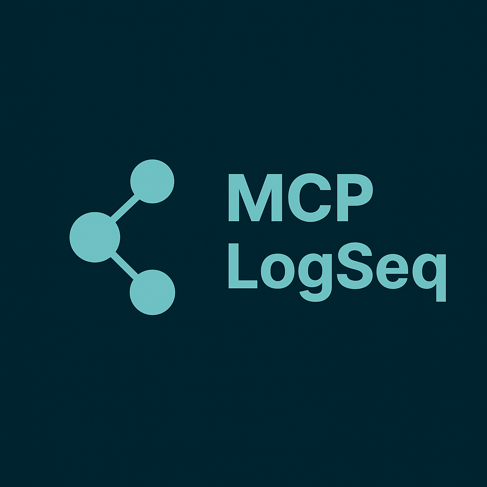

<div align="center">
  
  <h1>MCP server for LogSeq</h1>
  <p>Connect Claude to your LogSeq knowledge base. Read, create, and manage pages — with optional semantic vector search and DB-mode graph support.</p>
</div>

## ✨ What You Can Do

Transform your LogSeq knowledge base into an AI-powered workspace! This MCP server enables Claude to seamlessly interact with your LogSeq graphs.

### 🎯 Real-World Examples

**📊 Intelligent Knowledge Management**
```
"Analyze all my project notes from the past month and create a status summary"
"Find pages mentioning 'machine learning' and create a study roadmap"
"Search for incomplete tasks across all my pages"
```

**📝 Automated Content Creation**
```
"Create a new page called 'Today's Standup' with my meeting notes"
"Add today's progress update to my existing project timeline page"  
"Create a weekly review page from my recent notes"
```

**🔍 Smart Research & Analysis**
```
"Compare my notes on React vs Vue and highlight key differences"
"Find all references to 'customer feedback' and summarize themes"
"Create a knowledge map connecting related topics across pages"
```

**🧠 Semantic Search** *(optional, requires vector setup)*
```
"Find everything I wrote about burnout, even if I didn't use that word"
"What notes relate to my thoughts on deep work?"
"Search across my Dutch and English notes for ideas about productivity"
```

**🤝 Meeting & Documentation Workflow**
```
"Read my meeting notes and create individual task pages for each action item"
"Get my journal entries from this week and create a summary page"
"Search for 'Q4 planning' and organize all related content into a new overview page"
```

### 💡 Key Benefits
- **Zero Context Switching**: Claude works directly with your LogSeq data
- **Preserve Your Workflow**: No need to export or copy content manually
- **Intelligent Organization**: AI-powered page creation, linking, and search
- **Enhanced Productivity**: Automate repetitive knowledge work
- **Semantic Vector Search** *(optional)*: Find notes by meaning using local Ollama embeddings — no data leaves your machine
- **DB-mode Support** *(opt-in)*: Read and write class properties on Logseq DB-mode graphs

---

## 🚀 Quick Start

### Step 1: Enable LogSeq API
1. **Settings** → **Features** → Check "Enable HTTP APIs server"
2. Click the **API button (🔌)** in LogSeq → **"Start server"**
3. **Generate API token**: API panel → "Authorization tokens" → Create new

### Step 2: Add to Claude (No Installation Required!)

#### Claude Code
```bash
claude mcp add mcp-logseq \
  --env LOGSEQ_API_TOKEN=your_token_here \
  --env LOGSEQ_API_URL=http://localhost:12315 \
  -- uv run --with mcp-logseq mcp-logseq
```

#### Claude Desktop
Add to your config file (`Settings → Developer → Edit Config`):
```json
{
  "mcpServers": {
    "mcp-logseq": {
      "command": "uv",
      "args": ["run", "--with", "mcp-logseq", "mcp-logseq"],
      "env": {
        "LOGSEQ_API_TOKEN": "your_token_here",
        "LOGSEQ_API_URL": "http://localhost:12315"
      }
    }
  }
}
```

### Step 3: Start Using!
```
"Please help me organize my LogSeq notes. Show me what pages I have."
```

---

## 🔬 Vector Search (Optional)

Semantic search over your Logseq graph using local AI embeddings — find notes by meaning, not just keywords. Searches across all your pages using vector similarity and full-text search combined, with cross-language support.

Powered by [Ollama](https://ollama.com) (local embeddings) and [LanceDB](https://lancedb.com) (embedded vector DB). No data leaves your machine.

→ **[Full setup guide: VECTOR_SEARCH.md](VECTOR_SEARCH.md)**

---

## 🛠️ Available Tools

The server provides 16 tools with intelligent markdown parsing, plus 3 optional vector search tools:

| Tool | Purpose | Example Use |
|------|---------|-------------|
| **`list_pages`** | Browse your graph | "Show me all my pages" |
| **`get_page_content`** | Read page content | "Get my project notes" |
| **`create_page`** | Add new pages with structured blocks | "Create a meeting notes page with agenda items" |
| **`update_page`** | Modify pages (append/replace modes) | "Update my task list" |
| **`delete_page`** | Remove pages | "Delete the old draft page" |
| **`delete_block`** | Remove a block by UUID | "Delete this specific block" |
| **`update_block`** | Edit block content by UUID | "Update this specific block text" |
| **`search`** | Find content across graph | "Search for 'productivity tips'" |
| **`query`** | Execute Logseq DSL queries | "Find all TODO tasks tagged #project" |
| **`find_pages_by_property`** | Search pages by property | "Find all pages with status = active" |
| **`get_pages_from_namespace`** | List pages in a namespace | "Show all pages under Customer/" |
| **`get_pages_tree_from_namespace`** | Hierarchical namespace view | "Show Projects/ as a tree" |
| **`rename_page`** | Rename with reference updates | "Rename 'Old Name' to 'New Name'" |
| **`get_page_backlinks`** | Find pages linking to a page | "What links to this page?" |
| **`insert_nested_block`** | Insert child/sibling blocks | "Add a child block under this task" |
| **`set_block_properties`** | Set DB-mode class properties on a block | "Set the status of this block to active" *(DB-mode only)* |
| **`vector_search`** ⚗️ | Semantic search by meaning | "Find notes about shadow work or Jung" |
| **`sync_vector_db`** ⚗️ | Sync vector DB with graph files | "Update the search index" |
| **`vector_db_status`** ⚗️ | Show vector DB health and staleness | "Is my search index up to date?" |

⚗️ *Requires vector search setup — see [VECTOR_SEARCH.md](VECTOR_SEARCH.md)*

### 🎨 Smart Markdown Parsing (v1.1.0+)

The `create_page` and `update_page` tools now automatically convert markdown into Logseq's native block structure:

**Markdown Input:**
```markdown
---
tags: [project, active]
priority: high
---

# Project Overview
Introduction paragraph here.

## Tasks
- Task 1
  - Subtask A
  - Subtask B
- Task 2

## Code Example
```python
def hello():
    print("Hello Logseq!")
```
```

**Result:** Creates properly nested blocks with:
- ✅ Page properties from YAML frontmatter (`tags`, `priority`)
- ✅ Hierarchical sections from headings (`#`, `##`, `###`)
- ✅ Nested bullet lists with proper indentation
- ✅ Code blocks preserved as single blocks
- ✅ Checkbox support (`- [ ]` → TODO, `- [x]` → DONE)

**Update Modes:**
- **`append`** (default): Add new content after existing blocks
- **`replace`**: Clear page and replace with new content

### 🔁 Safe Retries & Large Writes

`create_page` fails with a clear error if a page with the same title already exists, instead of letting Logseq silently create numbered duplicates (`Page(1)`, `Page 2`, ...). This makes retries after a timeout safe: if a previous `create_page` call timed out but actually committed, the retry tells you the page exists rather than fragmenting your content across ghost pages.

For large writes, prefer this pattern over one giant `create_page` call:

1. Create the page with little or no content (`create_page` with just the title and properties)
2. Append content in smaller chunks with `update_page` (`mode: append`)
3. Read back with `get_page_content` to verify the result

If you hit the "already exists" error mid-ingest, use `get_page_content` to see what landed, then continue with `update_page` instead of re-creating.

---

## ⚙️ Prerequisites

### LogSeq Setup
- **LogSeq installed** and running
- **HTTP APIs server enabled** (Settings → Features)
- **API server started** (🔌 button → "Start server")  
- **API token generated** (API panel → Authorization tokens)

### System Requirements
- **[uv](https://docs.astral.sh/uv/)** Python package manager
- **MCP-compatible client** (Claude Code, Claude Desktop, etc.)

---

## 🔧 Configuration

### Environment Variables
- **`LOGSEQ_API_TOKEN`** (required): Your LogSeq API token
- **`LOGSEQ_API_URL`** (optional): Server URL (default: `http://localhost:12315`)
- **`LOGSEQ_API_CONNECT_TIMEOUT`** (optional): HTTP connect timeout in seconds (default: `3`)
- **`LOGSEQ_API_READ_TIMEOUT`** (optional): HTTP read timeout in seconds (default: `6`)
- **`LOGSEQ_DB_MODE`** (optional): Set to `true` to enable DB-mode property support. Only for Logseq DB-mode graphs (beta). Markdown/file-based graph users should leave this unset.
- **`LOGSEQ_EXCLUDE_TAGS`** (optional): Comma-separated tags — pages with these tags are hidden from all tools. See [Privacy & Access Control](#-privacy--access-control) below.
- **`LOGSEQ_INCLUDE_NAMESPACES`** (optional): Comma-separated namespace allow-list (e.g. `work,projects`). When set, **only** pages in these namespaces and their sub-pages are accessible — everything else, including top-level pages without a namespace, is hidden from listings/search and denied on direct access. See [Privacy & Access Control](#-privacy--access-control) below.
- **`LOGSEQ_EXCLUDE_NAMESPACES`** (optional): Comma-separated namespace deny-list (e.g. `finance,work/secret`). These namespaces are always blocked, taking priority over the include list. See [Privacy & Access Control](#-privacy--access-control) below.
- **`LOGSEQ_CONFIG_FILE`** (optional): Path to a shared JSON config file holding the graph path, ACL defaults, and the `vector` block. Env vars (`LOGSEQ_EXCLUDE_TAGS`, `LOGSEQ_INCLUDE_NAMESPACES`, `LOGSEQ_EXCLUDE_NAMESPACES`) override the matching keys in this file.
- **`MCP_HTTP_AUTH_TOKEN`** (required for `--transport http`): Bearer token clients must send as `Authorization: Bearer <token>`. The server refuses to start in HTTP mode without it. See [Serving over HTTP](#-serving-over-http-multi-profile) below.

### Privacy & Access Control

Pages tagged with excluded tags are completely hidden from AI — they won't appear in listings, searches, or queries, and attempting to read them directly returns an access-denied error.

**Quick setup via env var:**
```bash
LOGSEQ_EXCLUDE_TAGS=private,secret
```

**Via config file** (also used for [vector search](VECTOR_SEARCH.md)):
```json
{
  "logseq_graph_path": "/path/to/your/logseq/pages",
  "exclude_tags": ["private", "secret"]
}
```
Point to it with `LOGSEQ_CONFIG_FILE=/path/to/config.json`.

In your Logseq pages, tag any page you want to protect:
```
tags:: private
```

The exclusion applies to all tools: `list_pages`, `get_page_content`, `search`, `query`, and the optional vector search. If you also use vector search, `exclude_tags` at the root is automatically merged into the vector index exclusion list — private pages are never embedded.

#### Namespace access control

You can restrict access to specific namespaces using `LOGSEQ_INCLUDE_NAMESPACES` and `LOGSEQ_EXCLUDE_NAMESPACES`.

**Include list (strict allow-list):** Only the listed namespaces and their sub-pages are visible; everything else is hidden.
```bash
LOGSEQ_INCLUDE_NAMESPACES=work,projects
```

**Exclude list (deny-list):** The listed namespaces are always blocked, even if they appear in the include list.
```bash
LOGSEQ_EXCLUDE_NAMESPACES=work/secret,finance
```

**Via config file:**
```json
{
  "include_namespaces": ["work", "projects"],
  "exclude_namespaces": ["work/secret", "finance"]
}
```

Matching is segment-based and case-insensitive: `work` matches `work` and `work/projects` but not `workshop`. The behavior mirrors `LOGSEQ_EXCLUDE_TAGS`: list/search results silently omit blocked pages; direct read, write, delete, and block operations return an access-denied error.

**Known limitation:** access control is enforced at the **page** level. `search` and `query` filter out whole pages that are blocked, but individual blocks returned by a `query` DSL or by full-text `search` are not resolved back to their owning page, so a block belonging to a restricted page can still surface in those block-level results. Page listings, direct page/block access, backlinks, and vector search are all filtered; tighten DSL queries accordingly if this matters for your setup.

### 🔒 Security model

When serving multiple clients over HTTP, isolation rests on a few guarantees:

- **ACL is enforced server-side, before any bytes leave the process.** Blocked pages are filtered out of listings/search and denied on direct read/write — a client never receives content it isn't scoped to.
- **Bearer auth.** Every HTTP request must carry `Authorization: Bearer <MCP_HTTP_AUTH_TOKEN>`; unauthenticated requests are rejected.
- **Loopback binding.** Default `--host 127.0.0.1`; never `0.0.0.0`.
- **Process-boundary isolation.** Multi-instance means one profile's config (token, namespace scope, excluded tags) is never loaded by another process.
- **Read tools** enforce namespace allow/deny *or* tag exclusion. **Write tools** enforce namespace gating plus tag-on-write checks against the existing page, so a write can't slip into a blocked namespace or onto an excluded page.
- **Tag matching is case-SENSITIVE; namespace matching is case-INSENSITIVE.** Namespaces match regardless of case (`work` matches `Work/Projects`), but `LOGSEQ_EXCLUDE_TAGS` / `vector.exclude_tags` must match the **stored** tag casing exactly. Logseq typically stores tags lowercased, so `LOGSEQ_EXCLUDE_TAGS=Secret` will **not** exclude a page tagged `secret`. Match the casing as stored, or a page you meant to hide stays visible.

### 🌐 Serving over HTTP (multi-profile)

By default the server speaks **stdio** — the local client spawns it as a subprocess. For serving sandboxed or remote clients (each one only allowed to see a slice of your graph), the server can also run as a long-lived **HTTP** process:

```bash
mcp-logseq --transport http --host 127.0.0.1 --port 12320
```

- `--transport {stdio,http}` — default `stdio`.
- `--host` — default `127.0.0.1` (loopback). Binding a non-loopback host over plain HTTP is **refused** unless you supply TLS or pass `--insecure`; see [Step 3 — encrypt anything past loopback](#step-3--encrypt-anything-past-loopback).
- `--port` — default `12320`.
- `--read-only` — unregisters the 8 write tools (see [Security model](#-security-model)); read tools and the vector tools remain.
- `--tls-cert` / `--tls-key` — serve native HTTPS; see [Step 3](#step-3--encrypt-anything-past-loopback).

HTTP mode **requires** `MCP_HTTP_AUTH_TOKEN`; the server exits if it is missing. Clients authenticate with `Authorization: Bearer <token>` and target the MCP endpoint at **`/mcp`**. (A bare POST to `/mcp` issues a `307` redirect to `/mcp/`; point clients at `/mcp` and follow redirects, or use `/mcp/` directly.)

#### Step 1 — one instance per profile

A **profile** is one shared data config file + a per-process env block (namespace/tags/token) + its own port. Run **one instance per profile**. Every instance loads the *same* data config file (graph path, vector `db_path`, embedder); what differs is the per-process env block — and that env block **is** the profile.

```bash
# "journal-assistant" — reads your diary and reflects back, but can never edit it.
# Whole-instance read-only: no write tools at all.
LOGSEQ_CONFIG_FILE=~/.logseq/data.json \
LOGSEQ_INCLUDE_NAMESPACES=Journal \
MCP_HTTP_AUTH_TOKEN=$JOURNAL_TOKEN \
mcp-logseq --transport http --port 12320 --read-only

# "work" — full read/write within Work/, and explicitly no diary access.
LOGSEQ_CONFIG_FILE=~/.logseq/data.json \
LOGSEQ_INCLUDE_NAMESPACES=Work \
LOGSEQ_EXCLUDE_NAMESPACES=Journal \
MCP_HTTP_AUTH_TOKEN=$WORK_TOKEN \
mcp-logseq --transport http --port 12321

# "personal" — broad read/write, but credentials stay invisible.
LOGSEQ_CONFIG_FILE=~/.logseq/data.json \
LOGSEQ_EXCLUDE_TAGS=keys,secret \
MCP_HTTP_AUTH_TOKEN=$PERSONAL_TOKEN \
mcp-logseq --transport http --port 12322
```

The `LOGSEQ_CONFIG_FILE` is identical across all three instances; the per-process env block is what makes each one a distinct profile. Because each instance is its own process, one profile's env (token, namespace scope, excluded tags) is never loaded by another — isolation is the process boundary.

#### Step 2 — the separate sync writer

The vector DB has exactly **one** writer: a dedicated `logseq-sync` process deployed **outside** every MCP instance. It indexes the whole graph under a single global policy — `vector.exclude_tags` should hold only the secrets/never-store tags. Per-profile differentiation is purely *query-time* on the reader instances above; the index itself is shared.

```bash
# Continuous writer (launchd / systemd unit), owns the DB — same shared data file:
LOGSEQ_CONFIG_FILE=~/.logseq/data.json logseq-sync --watch

# Or scheduled one-shot (cron / launchd StartInterval):
LOGSEQ_CONFIG_FILE=~/.logseq/data.json logseq-sync --once
```

`logseq-sync` reads **no ACL env** — only the `vector` block and graph path from the data file. (`--rebuild` drops and re-indexes from scratch; `--status` prints a staleness report.) The reader profiles open the same `db_path` read-only and never run sync: the MCP `sync_vector_db` tool is inert and simply points operators at this external writer.

#### Step 3 — encrypt anything past loopback

> **The bearer token and all content travel as plaintext over plain HTTP.** Anything reachable beyond loopback must be encrypted — either native TLS on the instance, or a TLS-terminating reverse proxy in front of a loopback-bound instance.

To enforce this, the server **refuses to bind a non-loopback host over plain HTTP**. A host outside the loopback set (`127.0.0.1`, `localhost`, `::1`) requires one of:

- **Native TLS** — pass `--tls-cert` and `--tls-key`. TLS is allowed on any host.
- **A TLS-terminating reverse proxy** in front, with the instance bound to a loopback address (recommended — see below).
- **`--insecure`** — consciously accept an unencrypted non-loopback bind. Only sane on a trusted network or already behind a TLS proxy.

Loopback binds over plain HTTP need no opt-in; that remains the default.

**Native TLS** wraps the instance directly in HTTPS (uvicorn's `ssl_certfile`/`ssl_keyfile`):

```bash
mcp-logseq --transport http --port 12320 \
  --tls-cert /path/cert.pem --tls-key /path/key.pem
```

`--tls-cert` and `--tls-key` must be supplied **together** (both or neither, else the server exits), and both files **must exist** at startup. For the certificate itself: use [`mkcert`](https://github.com/FiloSottile/mkcert) or a self-signed cert for host-internal/dev use, or [Let's Encrypt](https://letsencrypt.org/) when the instance is reachable on a public DNS name. The per-profile env blocks from [Step 1](#step-1--one-instance-per-profile) are unchanged — TLS just changes the wire, not the profile.

**Recommended production path — reverse proxy with automatic HTTPS.** Bind the instance to loopback and let a proxy such as [Caddy](https://caddyserver.com/) terminate TLS (it obtains and renews Let's Encrypt certificates automatically):

```caddyfile
# Caddyfile — automatic HTTPS in front of a loopback-bound instance
logseq.example.com {
    reverse_proxy 127.0.0.1:12320
}
```

With the instance running as `mcp-logseq --transport http --port 12320` (loopback default, no `--insecure` needed), clients reach it over HTTPS at `logseq.example.com` while the unencrypted hop stays inside the host.

### Alternative Setup Methods

#### Using .env file
```bash
# .env
LOGSEQ_API_TOKEN=your_token_here
LOGSEQ_API_URL=http://localhost:12315
```

#### System environment variables
```bash
export LOGSEQ_API_TOKEN=your_token_here
export LOGSEQ_API_URL=http://localhost:12315
```

---

## 🔍 Verification & Testing

### Test LogSeq Connection
```bash
uv run --with mcp-logseq python -c "
from mcp_logseq.logseq import LogSeq
api = LogSeq(api_key='your_token')
print(f'Connected! Found {len(api.list_pages())} pages')
"
```

### Verify MCP Registration
```bash
claude mcp list  # Should show mcp-logseq
```

### Debug with MCP Inspector
```bash
npx @modelcontextprotocol/inspector uv run --with mcp-logseq mcp-logseq
```

---

## 🐛 Troubleshooting

### Common Issues

#### "LOGSEQ_API_TOKEN environment variable required"
- ✅ Enable HTTP APIs in **Settings → Features**
- ✅ Click **🔌 button** → **"Start server"** in LogSeq
- ✅ Generate token in **API panel → Authorization tokens**
- ✅ Verify token in your configuration

#### "spawn uv ENOENT" (Claude Desktop)
Claude Desktop can't find `uv`. Use the full path:

```bash
which uv  # Find your uv location
```

Update config with full path:
```json
{
  "mcpServers": {
    "mcp-logseq": {
      "command": "/Users/username/.local/bin/uv",
      "args": ["run", "--with", "mcp-logseq", "mcp-logseq"],
      "env": { "LOGSEQ_API_TOKEN": "your_token_here" }
    }
  }
}
```

**Common uv locations:**
- Curl install: `~/.local/bin/uv`
- Homebrew: `/opt/homebrew/bin/uv` 
- Pip install: Check with `which uv`

#### Connection Issues
- ✅ Confirm LogSeq is running
- ✅ Verify API server is **started** (not just enabled)
- ✅ Check port 12315 is accessible
- ✅ Test with verification command above

---

## 👩‍💻 Development

For local development, testing, and contributing, see **[DEVELOPMENT.md](DEVELOPMENT.md)**.

---

<div align="center">
  <p><strong>Ready to supercharge your LogSeq workflow with AI?</strong></p>
  <p>⭐ <strong>Star this repo</strong> if you find it helpful!</p>
</div>
